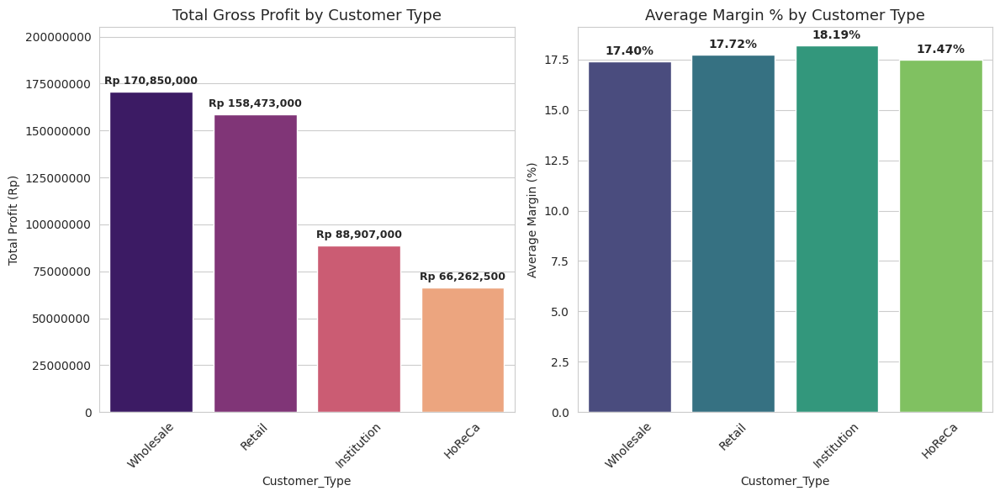
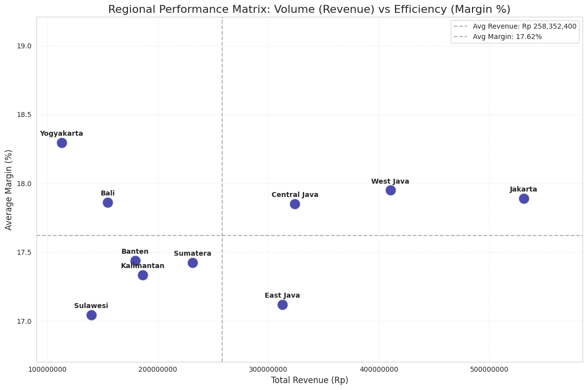
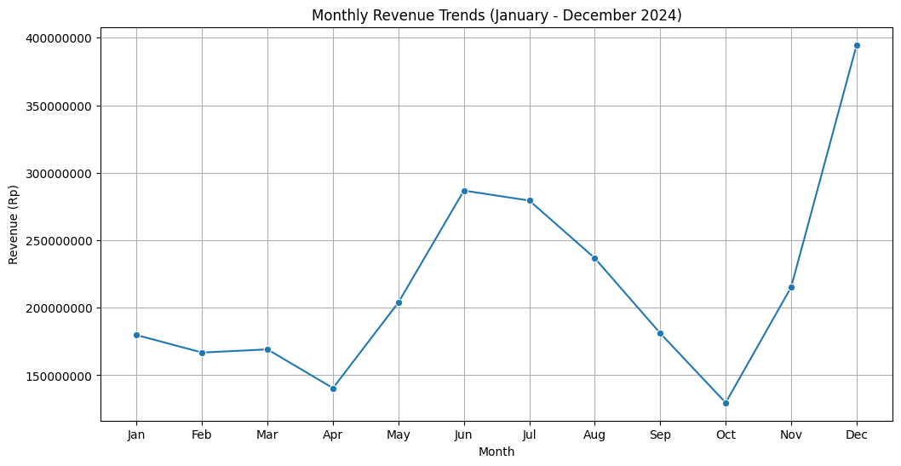

# Business Case Study: FMCG Revenue & Profitability Optimization
*Strategic Insights and Portfolio Optimization for Dairy & Processed Meats Division (2024)*

## 1. Executive Summary
An analysis of 2024 transactional sales data (1,500 records) was conducted to identify growth drivers, streamline the product portfolio, and optimize profitability across various distribution channels, customer segments, and regions in Indonesia.

* **Total Revenue:** Rp 2,583,524,000 (~Rp 2.58B)
* **Total Profit:** Rp 484,489,000 (~Rp 484M) with an average gross margin of **18.75%**.
* **Key Performance Drivers:** **Cheese (24.5% margin)** and **Sausage (21.7% margin)** are the primary profit engines. *So Good Chicken Sausage 375g* is the revenue leader, while *Anchor Cheddar Block 500g* is the single most profitable SKU.
* **Structural Bottlenecks:** A Pareto imbalance exists where 60% of SKUs (15/25) generate 80% of revenue. Ten products, mainly small-format yoghurts and milks (e.g., Cimory under 250ml/g), have been identified as "Dead Weight" (low revenue, low margin), diluting focus and operational efficiency.
* **Strategic Direction:** Rationalize the bottom 40% of the portfolio, capitalize on high-margin General Trade channels, expand direct Institutional sales, and aggressively prepare for Q4 end-of-year seasonality.

---

## 2. Problem Statement & Objectives
Despite steady top-line growth, the division faces challenges in inventory management, localized region-specific margin variations, and inefficient product mix. The primary objectives are:
1. Identify the high-performance "Stars" and "Cash Cows" to focus marketing resources.
2. Isolate and rationalise underperforming "Dead Weight" SKUs.
3. Understand channel margins and customer type interactions to optimize pricing strategies.
4. Forecast the next quarter's revenue trend to guide supply chain preparation.

---

## 3. Product Portfolio Analysis
### Category Performance Summary
| Product Category | Total Units Sold | Total Revenue (Rp) | Total Profit (Rp) | Average Margin % | Profit Contribution (%) |
|---|---|---|---|---|---|
| **Sausage** | 21,576 | 695,620,000 | 150,708,000 | 21.67% | 31.11% |
| **Cheese** | 15,592 | 571,759,000 | 140,069,000 | 24.50% | 28.91% |
| **Nugget** | 14,525 | 528,553,500 | 78,973,500 | 14.94% | 16.30% |
| **Milk** | 29,412 | 458,217,500 | 57,153,500 | 12.47% | 11.80% |
| **Yoghurt** | 21,987 | 329,374,000 | 57,588,500 | 17.48% | 11.89% |
| **Total** | **103,092** | **2,583,524,000** | **484,489,000** | **18.75%** | **100.00%** |

*Note: Sausage and Cheese account for 60% of total profits despite representing only ~36% of unit volume.*

### Pareto (80/20 Rule) Analysis
* **Core SKUs (60% of Portfolio):** 15 out of 25 SKUs generate **Rp 2,066,819,200** (~80%) of the revenue.
  * *Top Revenue Generator:* So Good Chicken Sausage 375g (Rp 241,238,500, 9.34% share)
  * *Top Profit Generator:* Anchor Cheddar Block 500g (Rp 54,587,000, 11.27% share)
* **Long-Tail SKUs (40% of Portfolio):** 10 SKUs generate the remaining 20% of revenue, experiencing low turnover and margins.

### "Dead Weight" SKU Assessment
These 10 products fall below average margins (18.75%) and generate low absolute revenue, indicating they are candidates for delisting or price adjustment:
1. **Cimory Yoghurt 500g** (Revenue: Rp 98,853,500 | Margin: 17.23%)
2. **Belfoods Royal Nugget 500g** (Revenue: Rp 93,720,000 | Margin: 14.84%)
3. **Cimory Yoghurt Drink 250ml** (Revenue: Rp 91,679,500 | Margin: 17.69%)
4. **Cimory Plain Yoghurt 400g** (Revenue: Rp 85,052,000 | Margin: 17.75%)
5. **Contadina Crispy Nugget 250g** (Revenue: Rp 72,388,000 | Margin: 14.86%)
6. **Champ Chicken Nugget 250g** (Revenue: Rp 68,159,000 | Margin: 15.48%)
7. **Cimory Yoghurt Strawberry 100g** (Revenue: Rp 32,694,000 | Margin: 17.39%)
8. **Cimory Chocolate 200ml** (Revenue: Rp 32,296,500 | Margin: 11.75%)
9. **Cimory Milk Vanilla 200ml** (Revenue: Rp 26,528,500 | Margin: 11.61%)
10. **Cimory Mini Yoghurt 60ml** (Revenue: Rp 21,095,000 | Margin: 17.22%)

---

## 4. Channel & Customer Segment Strategy
### Sales Channel Mix
* **Distributors:** The primary volume driver, contributing **Rp 1,431,835,000** (55.4% of revenue) and **Rp 267,612,000** of profit.
* **Modern Trade:** Contributes **Rp 668,744,500** (25.9% of revenue) and **Rp 125,754,000** of profit.
* **General Trade:** Contributes **Rp 482,944,500** (18.7% of revenue) and **Rp 91,126,500** of profit.
* *Margin Dynamics:* Although General Trade represents the smallest volume, it provides the highest average margin rate (**17.77%** vs. Modern Trade’s **17.5%** and Distributors' **17.3%**).

### Customer Segmentation

* **Wholesale:** Contributes **Rp 170,850,000** profit (Margin: 17.40%).
* **Retail:** Contributes **Rp 158,473,000** profit (Margin: 17.72%).
* **Institution:** Contributes **Rp 88,907,000** profit (Margin: 18.19%).
* **HoReCa (Hotel/Restaurant/Cafe):** Contributes **Rp 66,262,500** profit (Margin: 17.47%).
* *Strategic Opportunity:* **Institution** has the highest margin discipline (18.19%). However, institutional sales are currently highly reliant on distributors. Establishing direct institutional contracts could capture an additional 2-3% margin currently captured by middlemen.

---

## 5. Regional Diagnostics
Jakarta remains the core hub of operations, but secondary regions show promising profitability profiles.

| Region | Total Revenue (Rp) | Revenue Share | Total Profit (Rp) | Average Margin % |
|---|---|---|---|---|
| **Jakarta** | 531,247,500 | 20.56% | 99,725,000 | 17.89% |
| **West Java** | 410,571,000 | 15.89% | 76,613,500 | 17.95% |
| **Central Java** | 324,115,000 | 12.55% | 61,033,500 | 17.85% |
| **East Java** | 312,803,500 | 12.11% | 57,982,000 | 17.12% |
| **Sumatera** | 231,373,000 | 8.96% | 43,061,500 | 17.42% |
| **Kalimantan** | 186,348,500 | 7.21% | 34,283,500 | 17.33% |
| **Banten** | 179,652,000 | 6.95% | 32,570,000 | 17.44% |
| **Bali** | 154,602,500 | 5.98% | 30,646,000 | 17.86% |
| **Sulawesi** | 139,861,000 | 5.41% | 26,597,500 | 17.04% |
| **Yogyakarta** | 112,950,000 | 4.37% | 21,980,000 | 18.29% |

*Growth Opportunities:* **Yogyakarta** leads in average profit margin (**18.29%**), followed closely by **West Java (17.95%)** and **Jakarta (17.89%)**. Yogyakarta and Bali should be considered for targeted expansions due to high margin efficiency.

---

## 6. Trend & Predictive Revenue Forecasting

* **Seasonality:** Peak sales occur in **December (Rp 394,668,000)** due to end-of-year holiday demand.
* **Forecasted Revenue (Next Quarter):**
  * **Month 1 (Jan):** Rp 279,339,576
  * **Month 2 (Feb):** Rp 289,192,793
  * **Month 3 (Mar):** Rp 299,046,009
  * *Insight:* The linear upward trend suggests a strong recovery and growth starting Q1. Supply chain and inventory replenishment cycles must align with this gradual expansion.

---

## 7. Strategic Recommendations
1. **SKU Rationalization:** Delist or phase out the bottom 4 "Dead Weight" products (Cimory small-format milks: Chocolate 200ml, Vanilla 200ml, Mini Yoghurt 60ml) which drag down category margins. Re-allocate resources to Sausage and Cheese lines.
2. **Margin Optimization via Direct Institutional Sales:** Bypassing distributors for large institutional accounts (currently yielding 18.19% average margins) could increase bottom-line profit by 200-300 bps.
3. **Regional Prioritization:** Increase trade spending and distribution capabilities in **Yogyakarta** and **Bali** to capture high-margin transactions.
4. **Supply Chain Alignment:** Establish safety stock models starting in late November to ensure 100% service levels during the December peak, avoiding stockouts of premium SKUs like Anchor Cheddar Block and So Good Chicken Sausage.
